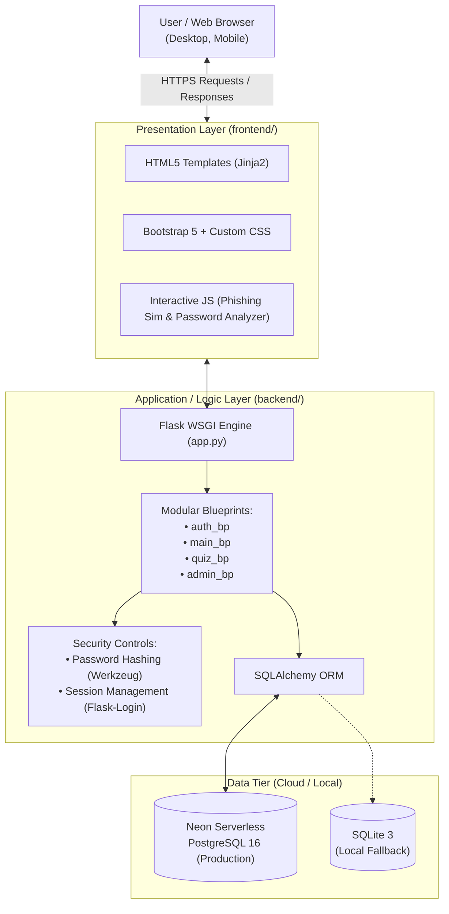
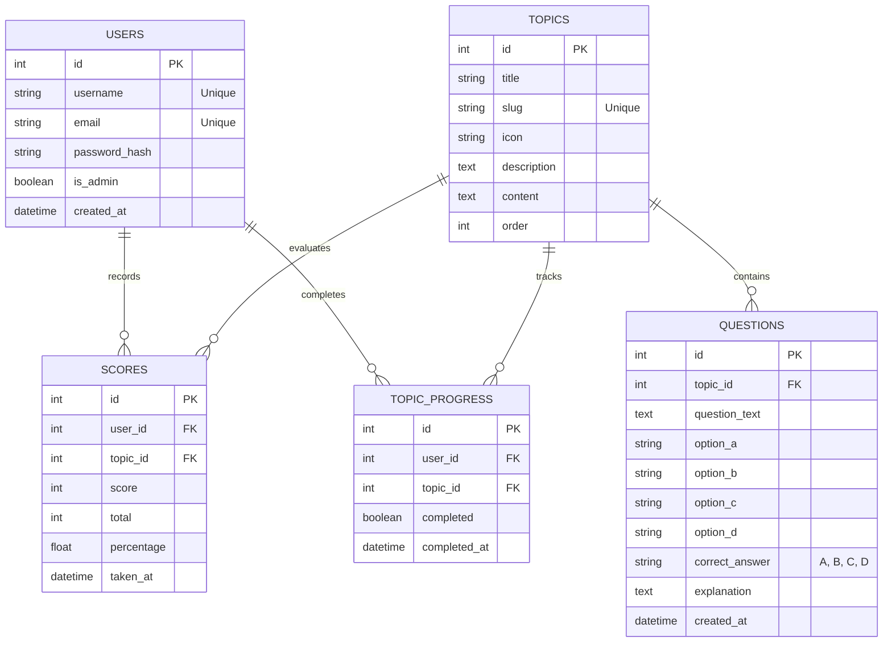
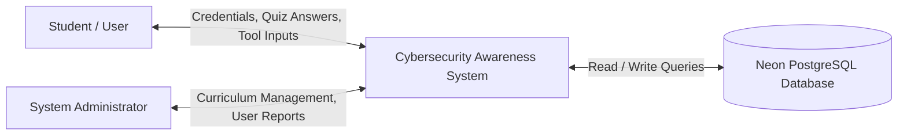
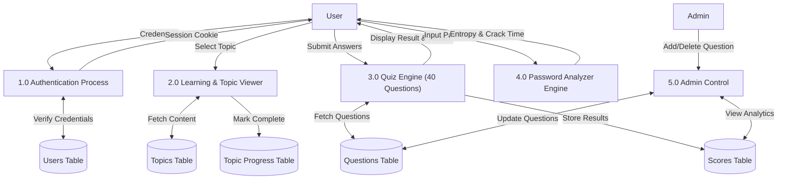

# 🎓 ACADEMIC PROJECT REPORT

## PROJECT TITLE:
# **CYBERSECURITY AWARENESS TRAINING PLATFORM**
### **Topic ID: #107 | Mini Project Submission**

---

### **Project Information**
* **Degree / Course**: Bachelor of Science in Information Technology (B.Sc. IT)
* **Domain**: Web Application Development & Cyber Security
* **Technologies**: Python 3.11/3.12, Flask 3.0, PostgreSQL 16 (Neon Cloud), SQLAlchemy 2.0, HTML5, CSS3, Bootstrap 5, JavaScript (ES6+)
* **Deployment**: Render Cloud Platform (WSGI Gunicorn)
* **Version Control**: Git / GitHub

---

## 📑 TABLE OF CONTENTS
1. [Abstract](#1-abstract)
2. [Introduction & Problem Statement](#2-introduction--problem-statement)
3. [Objectives & Scope](#3-objectives--scope)
4. [Software Requirements Specification (SRS)](#4-software-requirements-specification-srs)
5. [System Design & Architecture](#5-system-design--architecture)
   - 5.1 System Architecture Diagram
   - 5.2 Entity-Relationship (ER) Diagram
   - 5.3 Data Flow Diagrams (DFD Level 0 & Level 1)
   - 5.4 Database Schema
6. [Module Description](#6-module-description)
7. [Specialized Security Tools & Features](#7-specialized-security-tools--features)
8. [Legal Framework & Cybercrime Reporting](#8-legal-framework--cybercrime-reporting)
9. [Security & Best Practices](#9-security--best-practices)
10. [Testing & Verification](#10-testing--verification)
11. [Conclusion & Future Enhancements](#11-conclusion--future-enhancements)
12. [References](#12-references)

---

## 1. Abstract
With the rapid increase in digital services, cyber threats such as phishing, social engineering, weak passwords, and ransomware have grown exponentially. Most cybersecurity breaches occur due to human error and lack of digital awareness rather than system vulnerabilities. 

This project, **"Cybersecurity Awareness Training Platform"**, is a full-stack educational web application designed to educate students, employees, and everyday internet users on safe digital practices. Built using **Python (Flask)**, **SQLAlchemy ORM**, **Neon Serverless PostgreSQL**, and a responsive **Bootstrap 5** frontend, the platform provides:
- 8 comprehensive micro-learning modules with real-world defense checklists.
- An interactive **Password Strength & Entropy Analyzer** calculating real-time mathematical entropy and GPU crack-time estimations.
- An experiential **Phishing Simulator** training users on real-world deceptive email patterns.
- An expanded **40-Question Assessment Engine** offering topic-specific evaluations with instant explanatory rationales.
- Analysis of historical cyber incidents (WannaCry, Twitter VIP Hack, Colonial Pipeline, Pegasus).
- Integration of the **Information Technology (IT) Act, 2000** legal provisions and National Cyber Helpline (1930) reporting mechanisms.

---

## 2. Introduction & Problem Statement

### 2.1 Background
Human error accounts for over 90% of successful cyberattacks. While organizations invest heavily in firewalls and endpoint security, end-users routinely fall prey to deceptive social engineering tactics, credential reuse, and poor network hygiene.

### 2.2 Problem Statement
Traditional cybersecurity training consists of dry, static PDF guidelines or passive videos that fail to engage users. Without hands-on simulation, users cannot identify sophisticated threats (such as homograph domain spoofs, baiting, or zero-click exploits) in daily practice.

### 2.3 Proposed Solution
The proposed platform addresses this gap by offering:
- **Interactive Scenarios**: Users evaluate realistic emails to classify them as "Phishing" or "Safe" with immediate feedback.
- **Client-Side Security Tools**: Real-time password entropy calculation and passphrase generation.
- **Micro-Learning Curriculum**: 8 modular domains with structured Do's & Don'ts, comparison tables, and hardening guides.
- **Knowledge Assessment**: 40 multiple-choice questions dynamically loaded from a cloud PostgreSQL database.
- **Centralized Admin Control**: Secure administrative tools to manage curriculum questions and view student attempt metrics.

---

## 3. Objectives & Scope

### 3.1 Primary Objectives
1. To develop an intuitive, responsive web application for cybersecurity education.
2. To implement a secure user authentication system with password hashing (`Werkzeug PBKDF2/SHA-256`).
3. To construct a real-time mathematical Password Strength & Entropy Analyzer.
4. To build an experiential Phishing Detection Simulator.
5. To deploy the application with a serverless cloud database (**Neon PostgreSQL 16**) and cloud host (**Render**).

### 3.2 Project Scope
* **Users**: Can register, log in, test password entropy, browse cybersecurity modules, take quizzes, review answers, and track progress on a personal dashboard.
* **Administrators**: Can monitor platform metrics, manage questions, and publish new cybersecurity modules.
* **Platform Accessibility**: Cross-device compatibility across desktops, tablets, and smartphones via responsive Bootstrap 5 design.

---

## 4. Software Requirements Specification (SRS)

### 4.1 Hardware Requirements
* **Processor**: Dual-core Intel/AMD 2.0 GHz or higher
* **RAM**: Minimum 4 GB (8 GB recommended)
* **Storage**: Minimum 500 MB free disk space for local development
* **Client Device**: Any standard PC, laptop, or smartphone with an active internet connection

### 4.2 Software Requirements
* **Operating System**: Windows 10/11, macOS, or Linux
* **Programming Language**: Python 3.11 / 3.12
* **Web Framework**: Flask 3.0.3 (WSGI Framework)
* **Database Engine**: PostgreSQL 16 (via Neon Serverless) / SQLite (Local fallback)
* **Object-Relational Mapping (ORM)**: Flask-SQLAlchemy 3.1.1
* **Authentication**: Flask-Login 0.6.3
* **Production Web Server**: Gunicorn 22.0.0
* **Frontend Technologies**: HTML5, CSS3, JavaScript (ES6+), Bootstrap 5.3.2, FontAwesome 6.5
* **Browser**: Google Chrome, Mozilla Firefox, Microsoft Edge, or Safari

---

## 5. System Design & Architecture

### 5.1 System Architecture Diagram
The system implements a classic **Three-Tier Architecture** cleanly decoupling presentation, application logic, and data persistence:

---

### 5.2 Entity-Relationship (ER) Diagram

---

### 5.3 Data Flow Diagrams

#### **Level 0 DFD (Context Level)**

#### **Level 1 DFD**

---

### 5.4 Database Schema

#### Table 1: `users`
| Column | Type | Constraints | Description |
| :--- | :--- | :--- | :--- |
| `id` | Integer | Primary Key, Auto-increment | Unique identifier |
| `username` | Varchar(80) | Not Null, Unique | User handle |
| `email` | Varchar(120) | Not Null, Unique | User email address |
| `password_hash` | Varchar(256) | Not Null | Cryptographically salted hash |
| `is_admin` | Boolean | Default: False | Administrator privilege flag |
| `created_at` | DateTime | Default: UTC Now | Account creation timestamp |

#### Table 2: `topics`
| Column | Type | Constraints | Description |
| :--- | :--- | :--- | :--- |
| `id` | Integer | Primary Key, Auto-increment | Unique identifier |
| `title` | Varchar(120) | Not Null | Topic title |
| `slug` | Varchar(120) | Not Null, Unique | URL-friendly slug |
| `icon` | Varchar(10) | Default: 🔒 | Display emoji / icon |
| `description` | Text | Not Null | Brief summary |
| `content` | Text | Not Null | Full educational HTML body |
| `order` | Integer | Default: 0 | Display sequence order |

#### Table 3: `questions`
| Column | Type | Constraints | Description |
| :--- | :--- | :--- | :--- |
| `id` | Integer | Primary Key, Auto-increment | Unique identifier |
| `topic_id` | Integer | Foreign Key (`topics.id`) | Associated topic |
| `question_text` | Text | Not Null | Question description |
| `option_a` | Varchar(255) | Not Null | Option A text |
| `option_b` | Varchar(255) | Not Null | Option B text |
| `option_c` | Varchar(255) | Not Null | Option C text |
| `option_d` | Varchar(255) | Not Null | Option D text |
| `correct_answer`| Varchar(1) | Not Null (`A`, `B`, `C`, `D`) | Correct option key |
| `explanation` | Text | Nullable | Educational explanation |

#### Table 4: `scores`
| Column | Type | Constraints | Description |
| :--- | :--- | :--- | :--- |
| `id` | Integer | Primary Key, Auto-increment | Unique identifier |
| `user_id` | Integer | Foreign Key (`users.id`) | Submitting user |
| `topic_id` | Integer | Foreign Key (`topics.id`) | Evaluated topic |
| `score` | Integer | Not Null | Correct answers count |
| `total` | Integer | Not Null | Total questions count |
| `percentage` | Float | Not Null | Percentage calculation |
| `taken_at` | DateTime | Default: UTC Now | Exam submission timestamp |

#### Table 5: `topic_progress`
| Column | Type | Constraints | Description |
| :--- | :--- | :--- | :--- |
| `id` | Integer | Primary Key, Auto-increment | Unique identifier |
| `user_id` | Integer | Foreign Key (`users.id`) | Student identifier |
| `topic_id` | Integer | Foreign Key (`topics.id`) | Topic identifier |
| `completed` | Boolean | Default: False | Completion status flag |
| `completed_at` | DateTime | Nullable | Completion timestamp |

---

## 6. Module Description

### 6.1 Authentication Module (`routes/auth.py`)
* **Registration**: Validates uniqueness of usernames and emails, enforces an 8-character minimum password length, and securely hashes credentials using `generate_password_hash`.
* **Login & Session Management**: Authenticates users using `check_password_hash` and establishes secure HTTP session cookies managed via `Flask-Login`.
* **Access Control**: Implements `@login_required` decorators to prevent unauthorized access to sensitive pages.

### 6.2 Learning Modules (`routes/main.py`)
Provides structured lessons on 8 crucial domains:
1. 🔑 **Password Security & Credential Hygiene**: Entropy, password managers, brute-force defense.
2. 🎣 **Phishing, Smishing & Vishing Attacks**: Spear phishing, whaling, Punycode/homograph attacks.
3. 🦠 **Malware, Ransomware & Spyware Defense**: Ransomware lifecycles, 3-2-1 backup strategy.
4. 👤 **Social Engineering & Human Hacking**: Pretexting, baiting, tailgating, STOP protocol.
5. 🌐 **Safe Browsing & Web Security**: HTTPS/TLS, Drive-by downloads, DNS over HTTPS (DoH).
6. 🔐 **Multi-Factor Authentication (MFA / 2FA)**: Authentication factors, TOTP, YubiKey hardware tokens.
7. 📶 **Public Wi-Fi & Network Security**: Man-in-the-Middle (MitM) attacks, evil twins, VPN encryption.
8. 📱 **Mobile Device Security & App Safety**: Over-privileged apps, sideloading risks, Pegasus zero-click spyware.

### 6.3 Phishing Awareness Simulator (`templates/phishing.html`)
* An interactive client-side simulation presenting realistic email scenarios.
* Users evaluate email headers, sender addresses, links, and urgent language to classify each communication as **Phishing** or **Safe**.
* Provides immediate feedback explaining why the email is dangerous or legitimate.

### 6.4 Quiz & Assessment Engine (`routes/quiz.py`)
* Contains **40 curated questions** (expanded from 16) stored directly in PostgreSQL.
* Dynamically fetches questions associated with a specific topic.
* Evaluates submitted choices, calculates raw scores and percentages, and logs performance records into the database.
* Renders an in-depth answer review page highlighting correct answers, incorrect selections, and explanatory rationales.

### 6.5 User Dashboard (`routes/main.py`)
* Computes real-time student analytics:
  * Total topics completed vs. remaining.
  * Comprehensive progress bar.
  * Historical quiz logs with date, score, and grade indicators.
  * Aggregate percentage average across all quizzes.

### 6.6 Admin Control Panel (`routes/admin.py`)
* Accessible only to accounts with `is_admin = True` enforced by a custom `@admin_required` decorator.
* Capabilities:
  * Platform overview (Total Users, Topics, Questions, and Quiz Attempts).
  * Question management (Add new multiple-choice questions with answer keys).
  * Question deletion with cascade safeguards.
  * System-wide review of student quiz scores.

---

## 7. Specialized Security Tools & Features

### 7.1 Interactive Password Strength & Entropy Analyzer
* **Mathematical Entropy Calculation**: Uses the formula $E = L \times \log_2(R)$, where $L$ is length and $R$ is character pool size.
* **Brute-Force Crack Time Estimator**: Simulates crack times against a modern multi-GPU cracking cluster (100 Billion hashes/sec), displaying outcomes from *Instant* to *100 Million Years*.
* **Rule Compliance Engine**: Verifies length, uppercase, lowercase, numbers, symbols, and cross-checks against common leaked password lists.
* **Passphrase Generator**: Generates high-entropy multi-word passphrases (e.g., `Falcon-Matrix#452`).

### 7.2 Historical Cyber Attack Case Studies
* **WannaCry (2017)**: Ransomware exploiting unpatched SMB ports across 150 nations.
* **Twitter VIP Hack (2020)**: Phone spear-phishing compromising high-profile accounts.
* **Colonial Pipeline (2021)**: Single compromised VPN password halting US fuel supplies.
* **Pegasus Spyware**: Zero-click surveillance payloads targeting mobile devices.

---

## 8. Legal Framework & Cybercrime Reporting

### 8.1 Information Technology (IT) Act, 2000 (India)
* **Section 43**: Penalties for damage to computer systems, data theft, and unauthorized access (up to ₹1 Crore).
* **Section 66C**: Identity theft and stealing digital signatures/passwords (up to 3 years imprisonment).
* **Section 66D**: Cheating by personation using computer resource / Phishing (up to 3 years imprisonment).
* **Section 66E**: Privacy violations and unauthorized publishing of private images.

### 8.2 National Incident Reporting
* **National Cyber Crime Reporting Helpline**: **Dial 1930** (24/7 financial fraud response).
* **Official Portal**: `https://cybercrime.gov.in` for filing formal online FIRs.

---

## 9. Security & Best Practices

1. **Credential Protection**: Passwords are never stored in plaintext; they are transformed using salted cryptographic hashes (`PBKDF2/SHA-256`).
2. **Environment Variable Segregation**: Database URLs and secret keys are stored in environment variables (`.env`) and excluded from source control via `.gitignore`.
3. **SQL Injection Prevention**: All database interactions use parameterized queries provided by SQLAlchemy ORM, eliminating SQL injection vectors.
4. **Cross-Site Scripting (XSS) Mitigation**: Jinja2 automatic HTML escaping prevents injection of untrusted scripts into the DOM.
5. **Secure Transport Layer**: Production deployment utilizes HTTPS/TLS encryption provided by Render and SSL connection requirements by Neon PostgreSQL.

---

## 10. Testing & Verification

| Test Case ID | Test Scenario | Input Data | Expected Result | Actual Result | Status |
| :--- | :--- | :--- | :--- | :--- | :--- |
| **TC-01** | User Registration | Valid email, password (≥8 chars) | Account created, redirected to login | Account created successfully | **PASS** ✅ |
| **TC-02** | Duplicate User Handling | Existing registered email | Display error message | "Email already registered" alert | **PASS** ✅ |
| **TC-03** | Invalid Login | Correct email, wrong password | Reject login attempt | "Invalid email or password" alert | **PASS** ✅ |
| **TC-04** | Topic Progress Tracking | User views topic content | Status set to completed | Completed badge rendered, progress % updated | **PASS** ✅ |
| **TC-05** | Quiz Evaluation | Submit answers for topic #1 | Calculate score & store record | Score recorded in PostgreSQL, result page shown | **PASS** ✅ |
| **TC-06** | Phishing Simulator | Click "Phishing" on fraudulent email | Increase score, display rationale | Correct alert displayed with explanation | **PASS** ✅ |
| **TC-07** | Admin Route Authorization | Non-admin visits `/admin` | Access denied, redirect to home | "Admin access required" alert | **PASS** ✅ |
| **TC-08** | Database Failover | Cloud connection active | Direct queries to Neon DB | PostgreSQL responds with HTTP 200 | **PASS** ✅ |
| **TC-09** | Password Entropy Analyzer | Input `Tr@7#kL92!xQ` | Calculate entropy & crack time | ~3,000 years displayed with green bar | **PASS** ✅ |
| **TC-10** | IT Act 2000 & Helpline View | Load home page | Display 1930 & legal sections | Rendered correctly in dark card | **PASS** ✅ |

---

## 11. Conclusion & Future Enhancements

### 11.1 Conclusion
The **Cybersecurity Awareness Training Platform** successfully fulfills all objectives set forth for this project. By integrating micro-learning content, experiential phishing simulations, client-side entropy calculation, dynamic 40-question quiz assessments, and cloud persistence, the platform bridges the critical divide between theoretical security concepts and practical threat recognition. The project demonstrates a production-grade full-stack architecture using modern industry-standard frameworks and cloud platforms.

### 11.2 Future Enhancements
* **Gamified Leaderboards**: Public ranking system to foster healthy learning competition.
* **Automated PDF Certificate Generation**: Dynamic generation of signed completion certificates upon achieving a passing score across all modules.
* **Email Verification & Password Reset**: Integration with SMTP services (e.g., SendGrid) for self-service credential recovery.
* **Simulated Phishing Email Dispatch**: Ability for administrators to dispatch mock phishing emails to registered student inboxes to test real-world vigilance.

---

## 12. References
1. Grinberg, M. (2018). *Flask Web Development: Developing Web Applications with Python*. O'Reilly Media.
2. PostgreSQL Global Development Group. (2024). *PostgreSQL 16 Documentation*. https://www.postgresql.org/docs/
3. National Institute of Standards and Technology (NIST). (2023). *Security and Privacy Controls for Information Systems and Organizations* (NIST SP 800-53).
4. Bootstrap Team. (2024). *Bootstrap v5.3 Documentation*. https://getbootstrap.com/docs/5.3/
5. Ministry of Electronics and Information Technology (MeitY), Government of India. (2000). *The Information Technology Act, 2000*.
6. OWASP Foundation. (2024). *OWASP Top 10 Web Application Security Risks*. https://owasp.org/www-project-top-ten/
